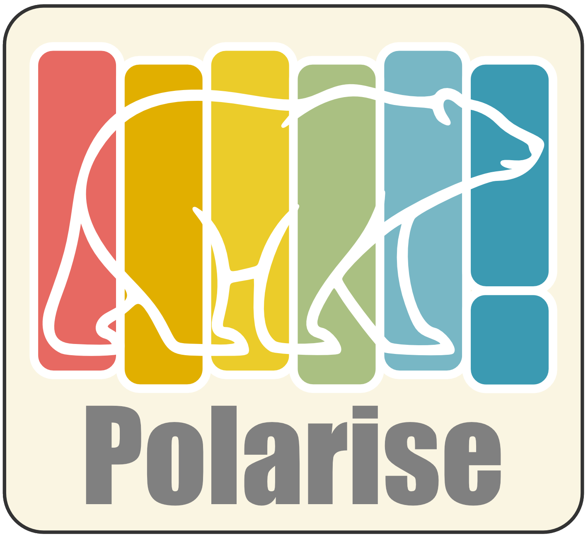
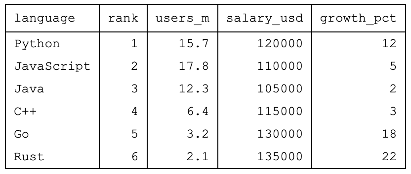
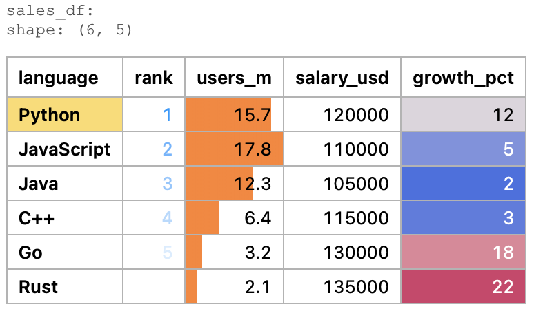
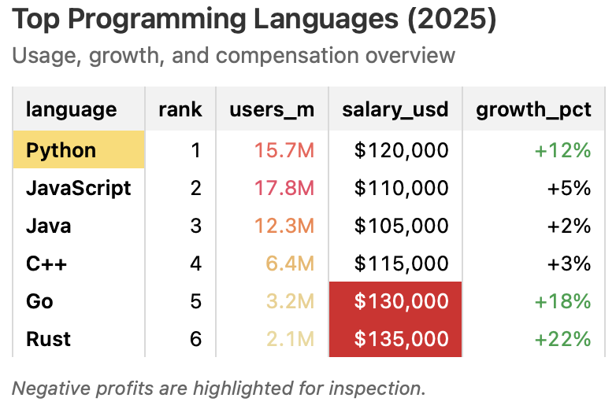

<h1 style="display:none">Polarise</h1>

<div style="text-align: center; margin: 2.5rem 0 1rem;">
  
</div>

<p style="text-align: center; font-style: italic; font-size: 1.2rem; line-height: 1.8; margin: 1rem 0 2.5rem;">
  Style your data to explore. Style your results to present.
</p>

<div style="display: flex; justify-content: center; margin: 1.5rem 0 2rem;">
  <div>
    <p><strong>A Polars-native DataFrame styling tool for HTML visualization</strong></p>
    <ul>
      <li>Fast, expressive styling with a clean, chainable API</li>
      <li>Turn Polars DataFrames into clear, expressive HTML views</li>
      <li>Style using native Polars expressions</li>
      <li>Built for data inspection, debugging, and exploration</li>
      <li>Ready for reports, presentations, and sharing</li>
    </ul>
  </div>
</div>

<div class="pol-hero-grid">
  <a href="assets/Hero_raw.html" target="_blank"></a>
  <a href="assets/Hero_explore.html" target="_blank"></a>
  <a href="assets/Hero_presentation.html" target="_blank"></a>
  <p class="pol-hero-label" style="font-family: 'Courier New', monospace;">Raw</p>
  <p class="pol-hero-label" style="font-family: Arial, sans-serif;">Explore</p>
  <p class="pol-hero-label" style="font-style: italic; font-family: 'Times New Roman', Times, serif;">Showcase</p>
</div>

---

## Quickstart

```bash
pip install polarise
```

```python
import polars as pl
import polarise

df = pl.DataFrame({
    "date": ["2024-01-01", "2024-01-02", "2024-01-03", "2024-01-04"],
    "region": ["EU", "EU", "US", "US"],
    "sales": [120, 85, 210, 250],
    "profit": [20, -15, 45, 55]
})

(
    df.style()
      .highlight_when(
          in_col="date",
          when=pl.col("profit") < 0,
          then_fill="alert_orange"
      )
      .gradient("sales", cmap="greens")
      .bar("profit", fill_pos="alert_green", fill_neg="alert_orange")
      .fashion_zebra()
      .show()
)
```

{{ read_html('snippets/home_hero.html') }}

---

## Where Polarise fits

Polarise is inspired by the styling capabilities of pandas, but built for a Polars workflow.

While [Great Tables](https://posit-dev.github.io/great-tables/articles/intro.html) provides a rich and highly customizable system for building publication-quality tables, it comes with a more structured and declarative approach.

Polarise takes a different path:

- Lightweight and fast
- Fully aligned with Polars expressions
- Designed for quick inspection and clean presentation

It started as a simple tool to explore Polars DataFrames visually, and grew into a practical way to produce clear, styled HTML tables for reports and sharing — with optional LaTeX export for simple use cases.

<div style="display: flex; justify-content: center; margin: 1.5rem 0;">
  <div>
    <p style="text-align: center;"><strong>At a glance</strong></p>
    <table>
      <thead>
        <tr>
          <th>Feature</th>
          <th>pandas Styler</th>
          <th>Great Tables</th>
          <th>Polarise</th>
        </tr>
      </thead>
      <tbody>
        <tr><td>Ecosystem</td><td>pandas</td><td>Polars</td><td>Polars</td></tr>
        <tr><td>Philosophy</td><td>Flexible, built-in</td><td>Rich, declarative</td><td>Lightweight, expressive</td></tr>
        <tr><td>Best for</td><td>General styling</td><td>Publication workflows</td><td>Inspection &amp; quick presentation</td></tr>
        <tr><td>Syntax</td><td>pandas-based</td><td>Table grammar</td><td>Polars expressions</td></tr>
        <tr><td>Complexity</td><td>Medium</td><td>High</td><td>Low</td></tr>
        <tr><td>Speed (iteration)</td><td>Medium</td><td>Slower</td><td>Fast</td></tr>
      </tbody>
    </table>
  </div>
</div>

---

[Get started →](getting_started.md) · [API Reference →](api/highlighting.md) · [Examples →](examples/finance.md)
